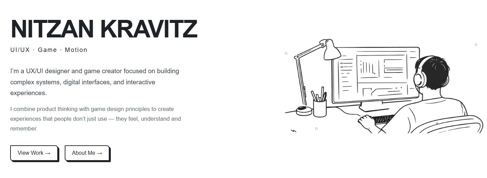

# 🎨 Nitzan Kravitz – Personal Portfolio




A personal portfolio website showcasing projects in UI/UX design, game design, and interactive experiences.

🔗 Live Website:  
https://nitz200.github.io/nitzan_portfolio/

---

## 🧠 About the Project

This project is a personal portfolio designed to present my work in a clear, minimal, and engaging way.

The website combines:
- Clean and structured UI/UX design  
- A minimalist visual language  
- Subtle interactive and playful elements  

The goal was to create a professional yet expressive platform that reflects both system thinking and creativity.

---

## 🛠️ Technologies Used

- HTML5  
- CSS3  
- JavaScript  

---

## 📁 Project Structure
nitzan_portfolio/
│
├── index.html
├── style.css
├── script.js
├── assets/
│ ├── images/
│ └── icons/
└── README.md

---

▶️ How to Run the Project

Option 1 – Open locally (recommended for this project)

1. Clone the repository:
```bash
git clone https://github.com/nitz200/nitzan_portfolio.git
Open the project folder
Run the project:
Open index.html in your browser

Option 2 – View online

Open the website directly:
https://nitz200.github.io/nitzan_portfolio/

🎯 Project Goals
Present selected works in a clear and accessible way
Create a clean and minimalist user experience
Combine design clarity with subtle interactivity
Reflect both product thinking and creative exploration

👤 Author
Nitzan Kravitz
UI/UX Designer | Game Designer | Interactive Creator

📬 Contact
nitzan200@yahoo.com
